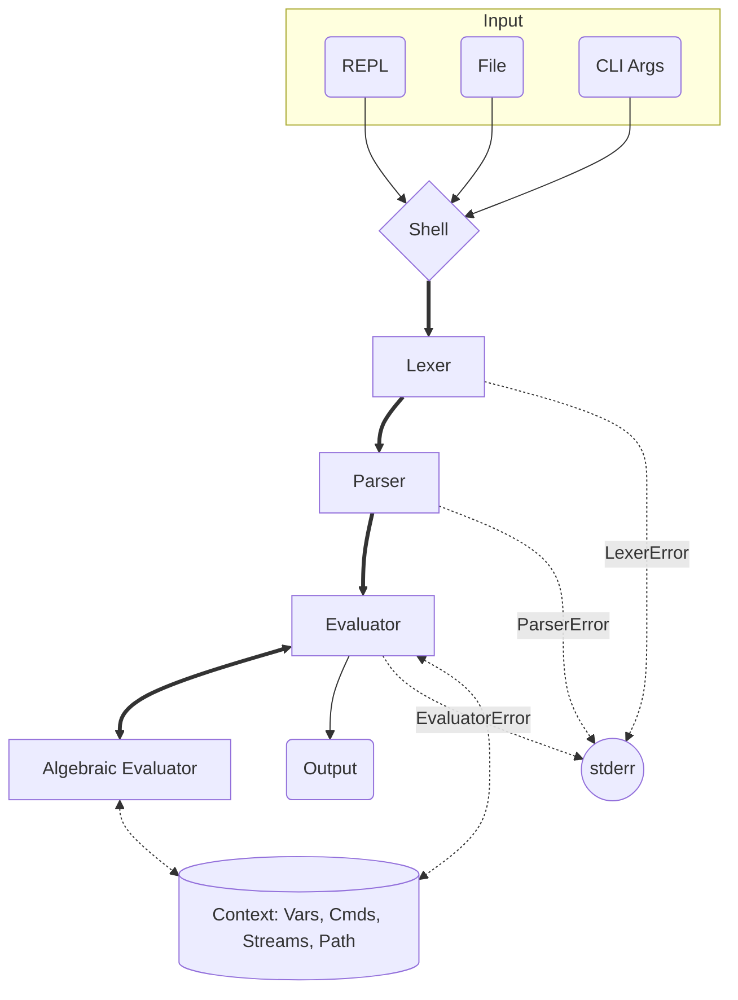

# ShelLang
A shell with the philosophy of minimizing syntax to the point of readable conciseness.

# Installation

## Dependencies

- CMake 3.31.11+
- C++ 23
- Git (optional)

## Setup
### Linux
```bash
git clone https://www.github.com/ItsCrist1/SwiftLang.git
cd SwiftLang
./scripts/setup.sh
```

## Running
This project has three ways of running:

| Mode   | Invocation                  | Description                                                                                               |
|--------|-----------------------------|-----------------------------------------------------------------------------------------------------------|
| REPL   | `ShelLang`                  | Starts an interactive prompt that shows the current path and reads lines until `ce` or EOF.               |
| File   | `ShelLang --file script.sl` | Reads the given file and evaluates its contents as a single program.                                      |
| Inline | `ShelLang <args...>`        | Joins all remaining arguments with spaces and evaluates them as one line. E.g. `ShelLang cp hello world`. |


# Architecture
The project is composed using the classic **Lexer -> Parser -> Evaluator** pattern:



# Syntax
## Redirects
Redirects work with two arguments:
- Source
- Target

| Sign | Source (data producer)           | Target (data receiver)                         |
|------|----------------------------------|------------------------------------------------|
| `>`  | Left side's output is captured.  | Right side receives the data.                  |
| `<`  | Right side's output is captured. | Left side receives the data                    |
| `>>` | Same as `>`.                     | Same as `>`, except files are **appended** to. |
| `<<` | Same as `<`.                     | Same as `<`, except files are **appended** to. |

### Examples

```sh
# Read a file into a variable
$x < input.in

# Write a command's output to a file (truncating)
cp hello world > out.txt

# Append instead of overwrite
cp another line >> out.txt

# Store the result of an expression in a variable
$area < 3.14 * $r * $r

# Chain a file through a command — read data.txt, feed its tokens as args to cp
cp < data.txt

# Pipe one command's output into another as args
ul -n > cp

# Capture the output of a loop into a file
while[$i <_ 10]
    cp $i
    $i < $i + 1
} > numbers.txt
```

Each node type behaves differently depending on which side of the redirect it sits on:

| Node            | As Source                                                                                                                             | As Target                                                                                                                                                                                                |
|-----------------|---------------------------------------------------------------------------------------------------------------------------------------|----------------------------------------------------------------------------------------------------------------------------------------------------------------------------------------------------------|
| `CmdNode`       | Runs the command, its output becoming the data. If the command isn't registered, it falls back to reading from a file with that name. | Runs the command with the source's output tokenized on whitespace and appended as extra args. If the command isn't registered, the name is treated as a filename and the data is written/appended to it. |
| `RedirectNode`  | Evaluated recursively: the result of the inner redirect becomes the data.                                                             | Evaluated recursively: with the source's tokenized output forwarded as extra args to the inner redirect.                                                                                                 |
| `VarNode`       | Reads the variable's current value as the input.                                                                                      | Assigns the source's full output (raw, untokenized) to the variable. Append vs overwrite is ignored.                                                                                                     |
| `AlgebraicNode` | Evaluates the expression; its numeric result becomes the data.                                                                        | Not handled                                                                                                                                                                                              |
| `IfNode`        | Evaluates the chosen branch and captures its output as the data.                                                                      | Not handled                                                                                                                                                                                              |
| `WhileNode`     | Evaluates the loop and captures the accumulated output of all iterations as the data.                                                 | Not handled                                                                                                                                                                                              |

# Commands

| Cmd  | Name             | Description                                               | Flags                                                                        |
|------|------------------|-----------------------------------------------------------|------------------------------------------------------------------------------|
| `pp` | Path Print       | Prints the current working directory.                     | —                                                                            |
| `pc` | Path Change      | Changes the working directory. `~` expands to `$HOME`.    | —                                                                            |
| `cp` | Console Print    | Prints its arguments separated by spaces, ending in `\n`. | —                                                                            |
| `ce` | Console Exit     | Exits the shell.                                          | —                                                                            |
| `cc` | Console Clear    | Clears the terminal (ANSI `\033[2J\033[H`).               | —                                                                            |
| `fr` | File Read        | Prints the contents of one or more files.                 | `-c` wrap output in a fenced code block with the filename                    |
| `ul` | Universal List   | Lists files and directories. Defaults to the current dir. | `-s` show sizes, `-r` recurse, `-n` newline-separated entries                |
| `ur` | Universal Remove | Removes files. Asks for confirmation on risky paths.      | `-r` also delete directories, `-n` skip files (pair with `-r` for dirs-only) |

# Credits
This project has been manually written entirely by its author with no assistance from AI tools beyond architectural discussions and debugging.
Uses [CMake](https://cmake.org/)

# License
This is licensed under [The MIT License](LICENSE)
See https://mit-license.org/